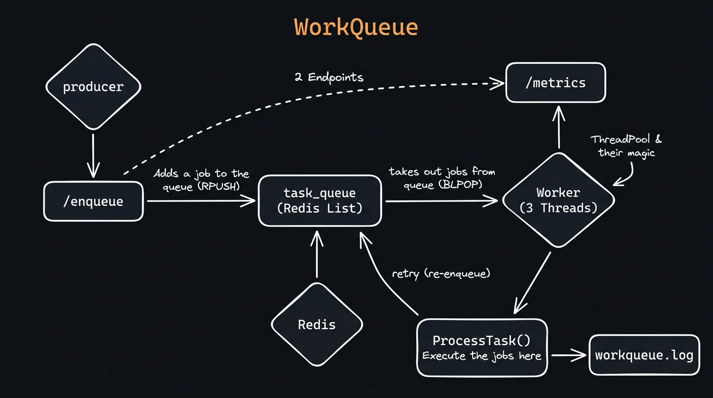
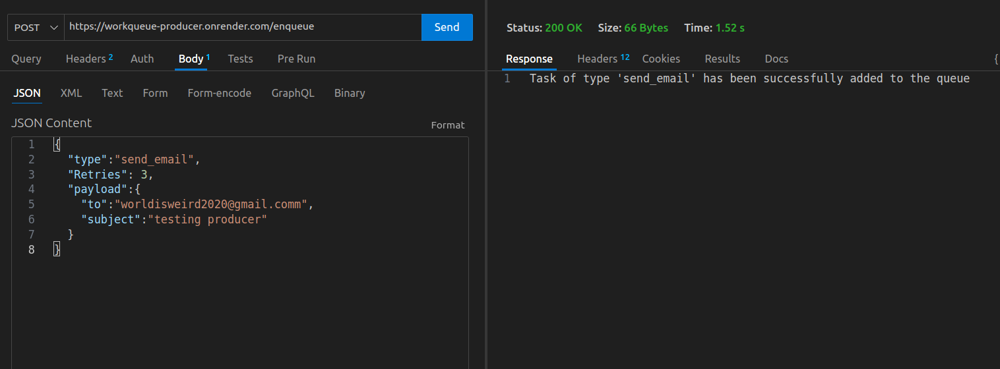
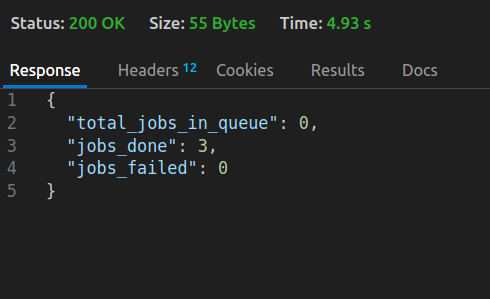
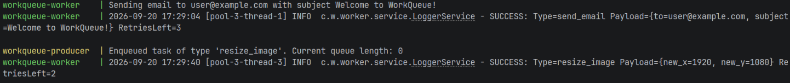

# WorkQueue

A Distributed Background Task Processing System written in Java Spring Boot, using Redis for job queuing.

**High level overview**




## What's the need for this?

This system is designed to handle the processing and execution of background tasks concurrently to improve user experience.

**Example:** When a user signs in to your website and clicks the login button, you might want to send them a welcome email. If that email task is part of the API call, the user would have to wait until the email is sent. Instead, you can add the "send_email" task to WorkQueue and let it handle the execution in the background.

**Note:** This is built to be modular — any type of job can be added to it, not just sending emails. You just need to add the logic for that job as described below.

## Services

This repo provides two independent microservices:

### 1. Producer

Provides a `/enqueue` route to add your jobs/tasks.

#### How to add a job?

- Send an HTTP POST request to the exposed `/enqueue` route on port `8080`
- It accepts a task in this format (JSON):

**Example: An inbuilt task the system supports is sending an email. Its JSON request would look like this:**

```json
{
    "type": "send_email",
    "retries": 3,
    "payload": {
        "to": "user@example.com",
        "subject": "Welcome to WorkQueue!"
    }
}
```

- **type** - REQUIRED. Tells the producer the type of job being added to the queue.
- **retries** - Number of times the system should re-enqueue the job if it fails during execution.
- **payload** - Contains details about the task in key-value pairs (Note: you can add any type/number of key-value pairs inside the payload, as the backend is built to flexibly accept all types).

This is the Java class it accepts:

```java
public class Task {
    private String type;
    private Map<String, Object> payload;
    private int retries;
}
```

The response will look like this:



### 2. Worker

- Takes the jobs from the queue in a reliable manner using blocking pop (`BLPOP`) and executes them using a **Thread Pool of 3 concurrent worker threads**
- Provides a `/metrics` endpoint to view statistics

#### How to view the status of your job?

Send an HTTP GET request to `http://localhost:8081/metrics`

This will give a response like this:



- **totalJobsInQueue** - Number of jobs inside the Redis queue at that moment
- **jobsDone** - Total number of jobs executed so far
- **jobsFailed** - Number of jobs that failed to execute, if any

## How are jobs executed?

Inside `worker/src/main/java/com/workqueue/worker/service/TaskProcessorService.java`, you will find this method. The switch case makes it modular enough so you can add your job type just by adding another case.

**To add a new type of task:** Just add its logic inside a new switch case, and that's it!

```java
public void processTask(Task task) throws Exception {
    if (task.getPayload() == null) {
        throw new Exception("Payload is empty");
    }

    // Add your task type here, and perform the task under your switch case
    switch (task.getType().toLowerCase()) {
        case "send_email":
            Thread.sleep(2000); // simulate delay
            System.out.println("Sending email to " + task.getPayload().get("to")
                    + " with subject " + task.getPayload().get("subject"));
            break;

        case "resize_image":
            System.out.println("Resizing image to x: " + task.getPayload().get("new_x")
                    + " y: " + task.getPayload().get("new_y"));
            break;

        case "generate_pdf":
            System.out.println("Generating PDF...");
            break;

        default:
            throw new Exception("Unsupported task type: " + task.getType());
    }
}
```

## Additional features

- **Concurrency** is provided to enable fast execution using a `ThreadPoolExecutor` with 3 worker threads running simultaneously, and thread-safe counters (`AtomicInteger`, `AtomicLong`).

- **Logging** of each event is provided via Logback and stored inside `logs/workqueue.log`. This helps to trace back the success or failure of a job.

Example:



---

Created by - [Yash Magarde](https://www.linkedin.com/in/yash-magarde/)